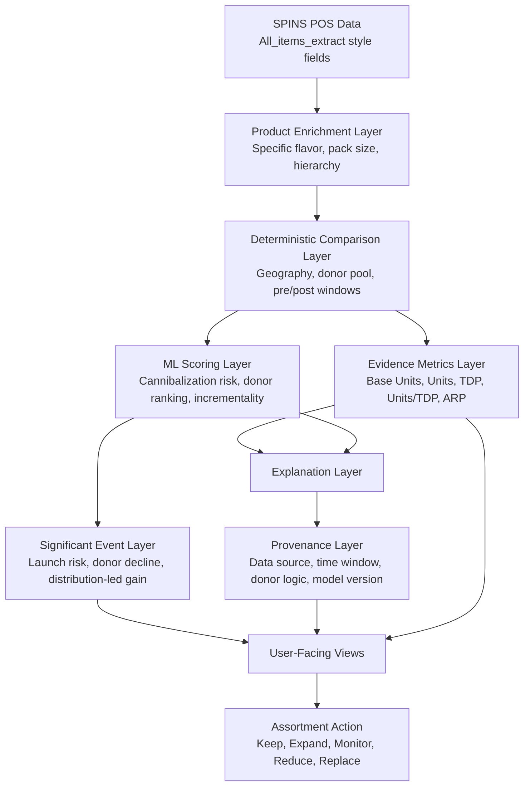
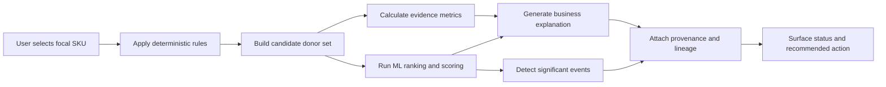
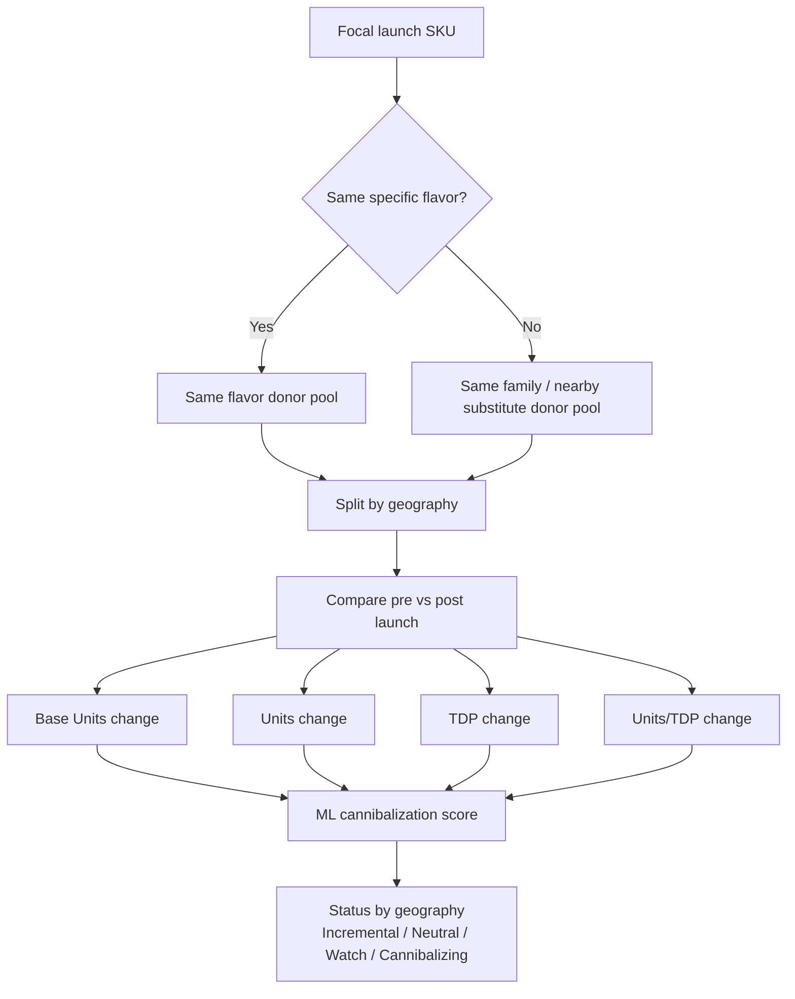
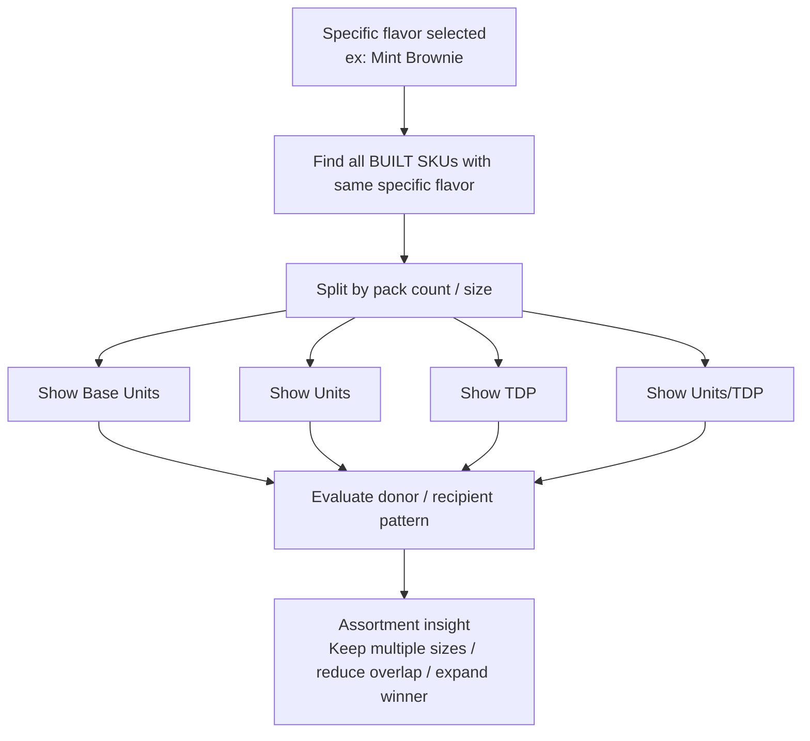
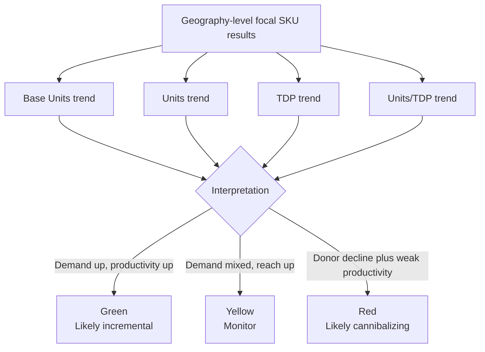
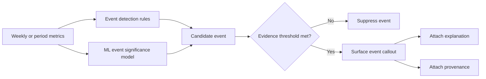
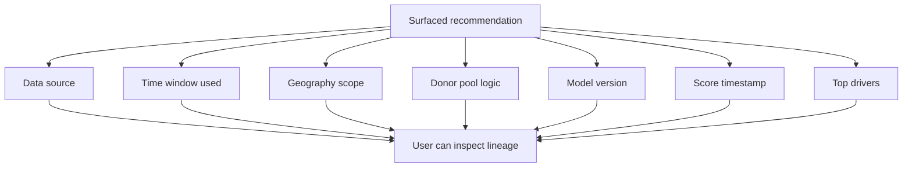
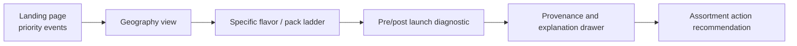

# BUILT Cannibalization Mermaid Diagrams

This artifact visualizes the proposed BUILT cannibalization experience using Mermaid.

It is designed around the product pattern we want:

- deterministic evidence first
- ML scoring and event detection as a powerful support layer
- explanation, provenance, and lineage exposed in a disciplined way
- polished user-facing decisions for assortment and product-mix optimization

## 1. End-to-End Product Flow

## 2. Deterministic Plus ML Decision Pattern

## 3. New SKU / New Pack Cannibalization View

## 4. Same Specific Flavor Pack-Size Ladder

## 5. Geography Heatmap Logic

## 6. Significant Event Callout Flow

## 7. Provenance Panel Structure

## 8. Screen-to-Screen UX Flow

## Recommended use

These diagrams are best paired with:

- [brad_built_cannibalization_view_wireframes_and_formulas.md](/Users/jasonbrazeal/Documents/FirstAgent/docs/brad_built_cannibalization_view_wireframes_and_formulas.md)
- [brad_built_ml_role_in_deterministic_cannibalization_tool.md](/Users/jasonbrazeal/Documents/FirstAgent/docs/brad_built_ml_role_in_deterministic_cannibalization_tool.md)
- [brad_built_cannibalization_views_for_assortment.md](/Users/jasonbrazeal/Documents/FirstAgent/docs/brad_built_cannibalization_views_for_assortment.md)
