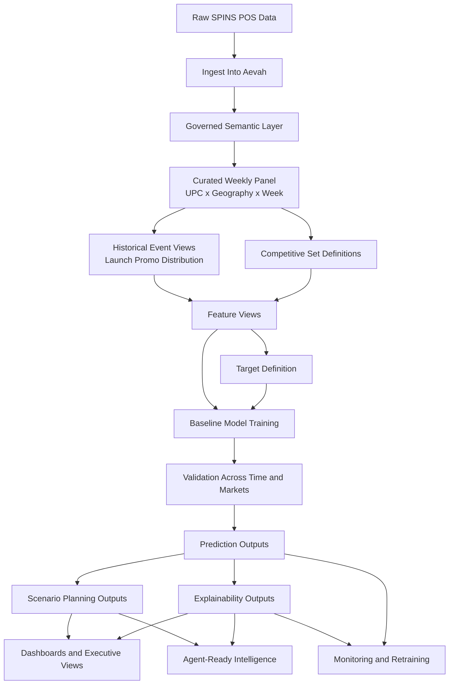
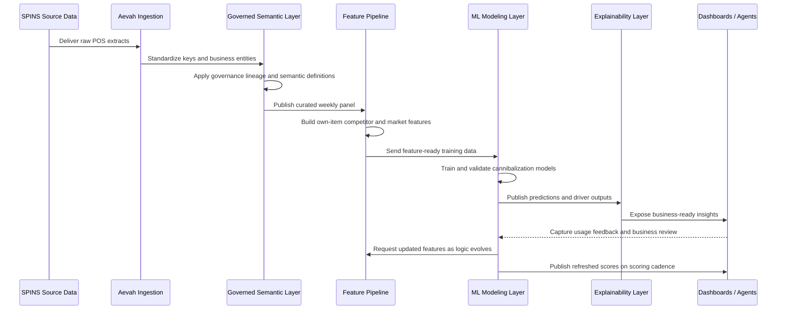
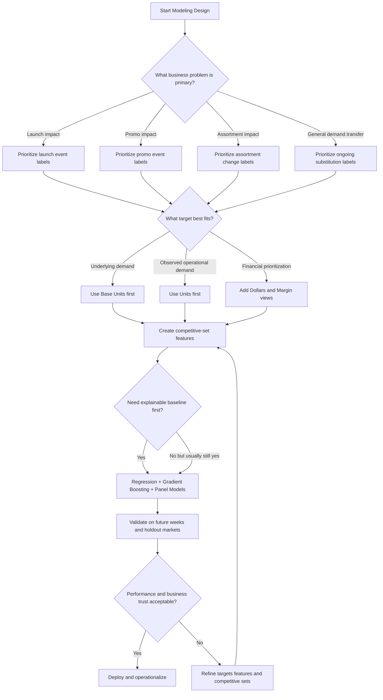
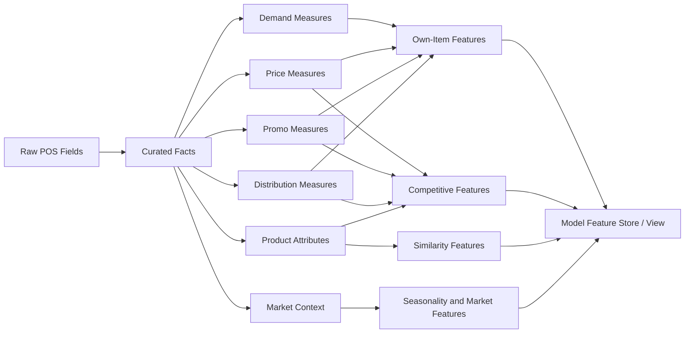
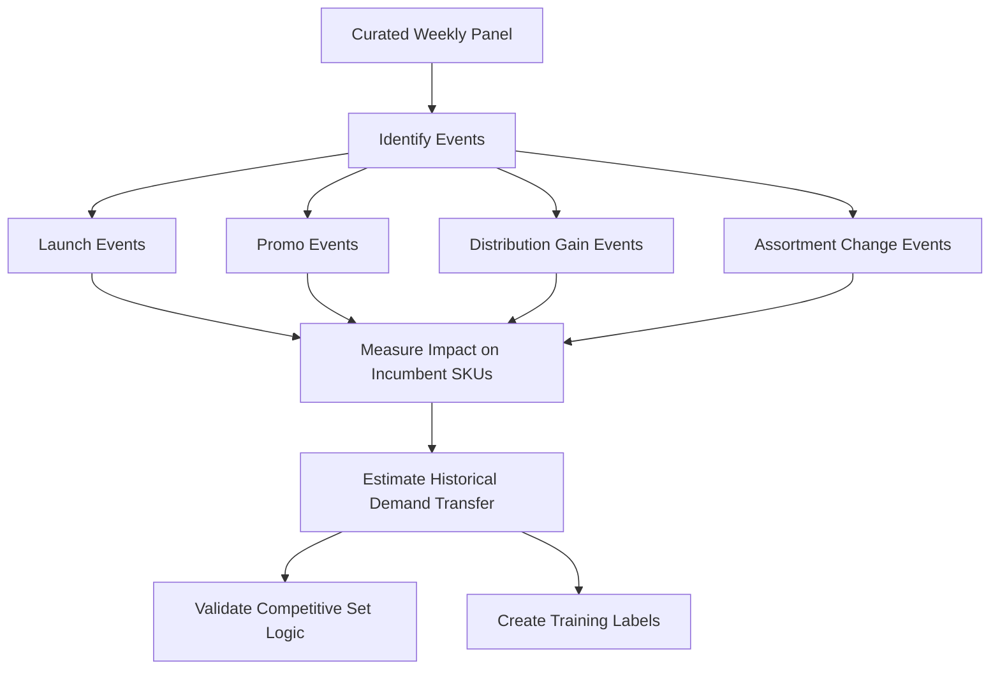
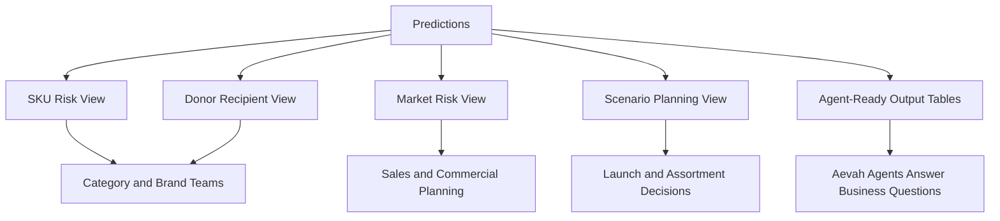
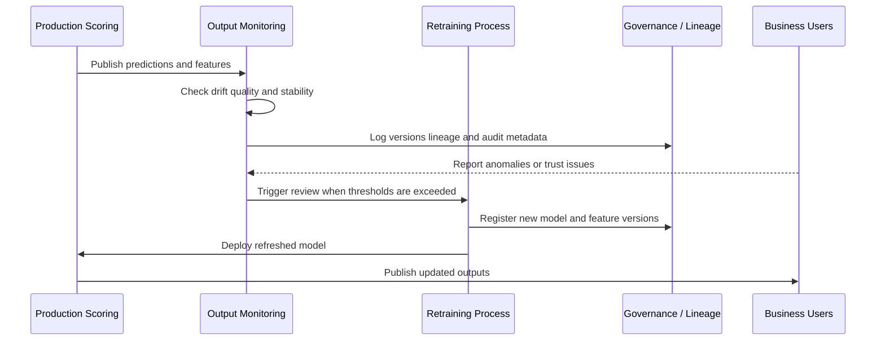
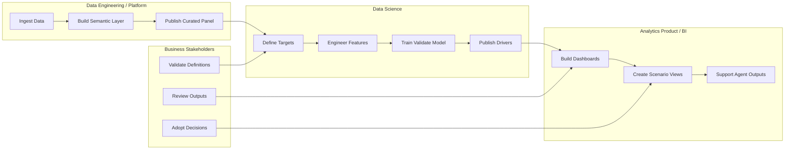

# Brad's Cannibalization Diagrams

This document provides visual companion artifacts for:

- `docs/brad_cannibalization_plan.md`
- `docs/brad_cannibalization_plan_aevah.md`
- `docs/brad_cannibalization_implementation_blueprint.md`

The diagrams are written in Mermaid so they can render in many IDEs and documentation viewers.

## 1. End-to-end flowchart

## 2. Delivery sequence through Aevah

## 3. Modeling decision flow

## 4. Data-to-feature flow

## 5. Historical measurement flow

## 6. Business consumption flow

## 7. Operational monitoring sequence

## 8. Suggested team swimlane view

## Notes

- These diagrams are intended to support planning and communication, not replace the written blueprint.
- If the team prefers, these can later be split into separate architecture, modeling, and operating docs.
- Mermaid rendering depends on IDE support. If a viewer does not render Mermaid, the source blocks can still be maintained as documentation.
