# Mo Feature Hierarchy Chart

This artifact groups the Mo solution around two top-level user objectives:

- Price Elasticity: decide what to price, promote, forecast, or defend.
- Product Cannibalization: decide what to keep, expand, monitor, reduce, or replace.

Open the visual chart here:

- [mo_feature_hierarchy_chart.html](/Users/jasonbrazeal/Documents/FirstAgent/mockups/mo_feature_hierarchy_chart.html)

## Visual hierarchy

```mermaid
flowchart TD
    A[Top-level user objective<br/>Make pricing, promo, launch, and assortment decisions] --> B[Price Elasticity]
    A --> C[Product Cannibalization]

    B --> B1[Determine<br/>Find significant price events]
    B --> B2[Diagnose<br/>Explain price, promo, pack, and competitor response]
    B --> B3[Decide<br/>Recommend pricing action]

    C --> C1[Determine<br/>Find significant demand-transfer events]
    C --> C2[Diagnose<br/>Explain donor, recipient, geography, and pack-ladder behavior]
    C --> C3[Decide<br/>Recommend assortment action]

    B1 --> B1a[UI<br/>Pricing event landing]
    B1 --> B1b[Queries<br/>Q14 weekly features<br/>Q17 training windows<br/>Q18 scored elasticity<br/>Q22 event queue]
    B1 --> B1c[Tables<br/>price_elasticity_weekly_features<br/>scored_price_elasticity<br/>price_event_queue]

    B2 --> B2a[UI<br/>Elasticity summary<br/>Promo response<br/>Pack price ladder<br/>Competitive price<br/>MULO norms]
    B2 --> B2b[Queries<br/>Q15 pack ladder<br/>Q16 competitive price<br/>Q19 forecast<br/>Q20 norms<br/>Q21 flavor/protein drivers]
    B2 --> B2c[Guardrails<br/>8+ usable weeks<br/>real price movement<br/>TDP and promo confounds<br/>competitor price completeness]

    B3 --> B3a[Actions<br/>Defend price<br/>Temporary promo response<br/>Test value correction<br/>Avoid permanent ARP cut]
    B3 --> B3b[UI<br/>What-if calculator<br/>Price explanation drawer]
    B3 --> B3c[Tables<br/>price_elasticity_forecast_weekly<br/>model version<br/>scenario inputs<br/>driver fields]

    C1 --> C1a[UI<br/>Priority event landing]
    C1 --> C1b[Queries<br/>Q0-Q13 cannibalization baseline flow]
    C1 --> C1c[Tables<br/>All_items_extract fields<br/>built_specific_flavor_mapping<br/>recommended SPINS measures]

    C2 --> C2a[UI<br/>New SKU summary<br/>Geography heatmap<br/>Same specific flavor pack ladder<br/>Pre/post launch diagnostic<br/>Likely donor list]
    C2 --> C2b[Metrics<br/>Base Units<br/>Units<br/>TDP<br/>Units/TDP<br/>ARP<br/>First Week Selling]
    C2 --> C2c[Guardrails<br/>distribution-led gain vs productivity gain<br/>same flavor before same family<br/>geography-specific status<br/>launch ramp window]

    C3 --> C3a[Actions<br/>Keep multiple sizes<br/>Expand winner<br/>Monitor rollout<br/>Reduce overlap<br/>Replace donor]
    C3 --> C3b[UI<br/>Explanation drawer<br/>Provenance drawer]
    C3 --> C3c[Metadata<br/>source data<br/>scoring window<br/>donor pool definition<br/>model version<br/>confidence]

    D[Shared foundation<br/>UPC x geography x week panel<br/>product enrichment<br/>evidence metrics<br/>trust layer] --> B
    D --> C

    E[Cross-objective handoffs<br/>Promo lift source<br/>Pack ladder compression<br/>Competitor gap context<br/>Unified action queue] --> B3
    E --> C3
```

## How suggested components fit

| Component or action | Objective | Phase | Why it belongs there |
|---|---|---|---|
| Pricing event landing | Price Elasticity | Determine | It detects where the analyst should look first. |
| Elasticity summary | Price Elasticity | Diagnose | It explains own-price response and confidence. |
| Pack price ladder | Price Elasticity and Cannibalization | Diagnose | It shows whether price gaps are creating demand transfer across pack sizes. |
| Competitive price gap | Price Elasticity | Diagnose | It separates external pressure from internal BUILT pack pressure. |
| What-if calculator | Price Elasticity | Decide | It converts price scenarios into forecasted demand impact. |
| Priority event landing | Product Cannibalization | Determine | It surfaces demand-transfer risk without forcing SKU-by-SKU hunting. |
| Geography heatmap | Product Cannibalization | Diagnose | It shows where the same launch is incremental, mixed, or cannibalizing. |
| Same specific flavor pack ladder | Product Cannibalization | Diagnose | It identifies donor and recipient behavior inside the closest substitute set. |
| Explanation and provenance drawers | Both | Decide | They make recommendations auditable and business-readable. |
| Defend price | Price Elasticity | Decide | It prevents overreacting to competitor gaps when BUILT demand remains healthy. |
| Monitor | Both | Decide | It handles early, mixed, or low-confidence evidence without hiding the signal. |
| Expand winner | Product Cannibalization | Decide | It supports rollout when demand and productivity rise without donor damage. |
| Reduce overlap | Product Cannibalization | Decide | It responds when a SKU lift appears sourced from another BUILT item. |

## Shared data foundation

The hierarchy assumes one shared evidence layer:

- Product enrichment: UPC, description, brand, specific flavor, flavor family, pack count, protein attributes.
- Weekly panel: UPC x geography x week demand, price, promo, and distribution measures.
- Evidence metrics: Base Units, Units, Dollars, TDP, Units/TDP, ARP, promo and non-promo splits.
- Trust layer: confidence, event thresholds, model version, source columns, scoring window, and provenance.
