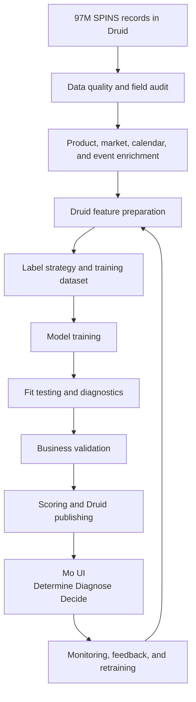

# Mo ML Playbook: From Druid SPINS Data to User-Facing Intelligence

This playbook walks through the process for taking the uploaded 97M-record SPINS
datasource in Apache Druid, preparing it for machine learning, training and
validating the models, and presenting trusted recommendations through the Mo UI.

The audience is an executive stakeholder or CIO first, with technical details
included beneath each stage for implementation teams.

Open the visual playbook here:

- [mo_ml_playbook_from_druid_to_ui.html](/Users/jasonbrazeal/Documents/FirstAgent/mockups/mo_ml_playbook_from_druid_to_ui.html)

## Stage 1: Data Intake and Governance

**Executive view:** Confirm that the 97M-record SPINS datasource is complete,
stable, and fit to become an enterprise analytics asset. This stage protects the
organization from building models on malformed, incomplete, or poorly governed
source data.

**Technical work:**

- Confirm datasource name, grain, time column, row count, retention, and segment health.
- Verify the source grain is UPC x geography/account/channel x week.
- Preserve all raw demand, price, promo, distribution, product, and retail fields.
- Avoid filtering to BUILT-only at ingestion; competitor and category history are required.
- Register ownership, refresh cadence, source lineage, and access rules.

**Exit criteria:** Druid datasource is queryable, complete, permissioned, and
ready for normalization.

## Stage 2: Source Data Quality and Field Audit

**Executive view:** Before modeling starts, the team validates that the fields
needed to explain demand transfer and price response are present and trustworthy.
This is the quality gate that prevents "black box" or misleading outputs later.

**Technical work:**

- Audit required fields: UPC, description, brand, geography, account/channel,
  week end date, units, base units, dollars, base dollars, TDP, ARP, promo
  measures, first week selling, pack count, flavor, and store-selling measures.
- Check null rates, duplicate keys, negative values, impossible prices, missing
  pack counts, and inconsistent UPC formatting.
- Compare row counts by week, geography, brand, and category to detect ingestion gaps.
- Flag military/DECA or other special channels if they should be suppressed.

**Exit criteria:** Field coverage and quality report is signed off, with known
limitations captured as model guardrails.

## Stage 3: Product, Market, Calendar, and Event Enrichment

**Executive view:** The raw SPINS feed is converted into business language:
product families, pack ladders, specific flavors, retail accounts, market
hierarchies, calendar seasonality, and known product events. This is what lets
Mo explain *why* something happened, not just that it happened.

**Technical work:**

- Load product master and similarity mappings for BUILT and eligible competitors.
- Attach normalized specific flavor, flavor family, brand line, pack count,
  pack-size band, protein attributes, competitor tier, and category substitute group.
- Load market hierarchy: account, banner, channel, region, geography type.
- Load calendar dimensions: fiscal period, week of year, season, holiday flags.
- Load event history when available: launches, discontinuations, assortment changes,
  promo events, pricing actions, and known supply/availability issues.

**Exit criteria:** Enriched weekly panel can support stable joins, comparison
pool generation, seasonality controls, and explanation metadata.

## Stage 4: Druid Feature Preparation

**Executive view:** The 97M raw rows are not sent directly to machine learning.
Druid first compresses them into governed, explainable feature tables that
represent the business questions Mo needs to answer.

**Technical work:**

- Build `built_filtered_weekly` to normalize source fields and keep BUILT plus
  relevant category competitors.
- Build `built_enriched_weekly` with product, market, and flavor enrichments.
- Build `comparison_pool_weekly` to create focal/candidate pairs for pack ladder,
  same-flavor, same-family, same-brand, and competitor scopes.
- Build pre/post feature tables:
  - `built_prepost_features`
  - `donor_prepost_features`
  - `ml_training_features`
- Build event and launch-monitoring tables:
  - `event_detection_weekly`
  - `new_upc_candidates`
  - `new_upc_classifications`
  - `new_product_ramp_monitor`

**Exit criteria:** Feature tables exist at the correct grain, are reproducible,
and can be queried without scanning the full raw datasource for every workflow.

## Stage 5: Label Strategy and Training Dataset Assembly

**Executive view:** Because SPINS does not come with a pre-labeled
"cannibalization happened" field, the team creates transparent deterministic
labels from observable business evidence. These labels become the supervised
learning foundation.

**Technical work:**

- Create cannibalization labels from focal and donor pre/post behavior:
  - `CANNIBALIZING`
  - `WATCH`
  - `INCREMENTAL`
  - `NEUTRAL`
- Create secondary labels for distribution-led versus demand-led growth.
- Compute `incremental_share` so the UI can distinguish net-new demand from
  demand transferred from a donor SKU.
- Suppress or downgrade training rows with insufficient weeks, promo confounds,
  heavy TDP movement, missing competitor context, or ramp-period instability.
- Use relationship distance and pack distance as structural substitution features.

**Exit criteria:** Training dataset has labels, features, guardrail flags,
data-quality fields, and lineage to the source Druid records.

## Stage 6: Model Training

**Executive view:** Mo trains several focused models rather than one oversized
model. Each model has a clear job: identify cannibalization risk, rank likely
donors, detect important events, and estimate price response.

**Technical work:**

- Train cannibalization classifier on `ml_training_features`.
- Train donor ranker to order likely donor SKUs.
- Train event detector to prioritize material business events.
- Train price elasticity models for:
  - own-price elasticity
  - cross-price elasticity
  - promo elasticity
  - price/promo forecast scenarios
- Start with interpretable baselines and regularized models, then advance to
  LightGBM or similar tree-based models with SHAP-style drivers.
- Track model version, training data version, feature list, hyperparameters,
  and random seed.

**Exit criteria:** Candidate models are trained with versioned artifacts,
reproducible inputs, and documented feature importance.

## Stage 7: Fit Testing and Model Diagnostics

**Executive view:** The team tests whether each model actually learned useful
patterns instead of memorizing noise, seasonality, distribution changes, or
promotional shocks.

**Technical work:**

- Evaluate classification metrics: precision, recall, F1, ROC-AUC, PR-AUC, and
  calibration by confidence bucket.
- Evaluate donor ranking with top-k hit rate, mean reciprocal rank, and review
  of top-ranked donor explanations.
- Evaluate event detector precision so Mo does not overwhelm users with weak alerts.
- Evaluate price models with out-of-sample error, elasticity sign checks, and
  stability by geography/account/pack size.
- Run diagnostics by relationship distance, geography, channel, pack count,
  flavor family, launch age, promo intensity, and TDP movement.

**Exit criteria:** Model performance is acceptable overall and stable across
important business segments, or limitations are documented as UI guardrails.

## Stage 8: Validation and Business Review

**Executive view:** Model quality is not accepted by statistics alone. Business
stakeholders review examples to confirm that recommendations make commercial
sense and are explainable enough to trust.

**Technical work:**

- Review high-confidence cannibalization cases, low-confidence cases, false
  positives, and false negatives.
- Compare model conclusions against known launches, assortment changes, and
  pricing actions.
- Verify that recommended actions match commercial intuition:
  - keep
  - expand
  - monitor
  - reduce overlap
  - defend price
  - test price correction
- Confirm explanations cite real evidence: donor decline, focal lift, TDP movement,
  price change, promo depth, competitor gap, and scoring window.

**Exit criteria:** Business reviewers approve the model behavior, action language,
and confidence thresholds for pilot use.

## Stage 9: Scoring, Event Packaging, and Druid Publishing

**Executive view:** Validated model outputs are converted into governed Druid
tables that the product can query reliably. This makes Mo operational rather
than experimental.

**Technical work:**

- Score focal x donor x account x geography x window pairs.
- Write `scored_cannibalization` with status, risk score, incremental share,
  donor rankings, confidence, top drivers, model version, and lineage.
- Write price outputs:
  - `scored_price_elasticity`
  - `price_elasticity_forecast_weekly`
  - `price_event_queue`
- Assemble unified event queues with suppression rules and event severity.
- Store provenance: source datasource, scoring window, feature table version,
  model version, score timestamp, and source columns.

**Exit criteria:** Scored output tables are available in Druid and match the UI
contracts for Mo screens.

## Stage 10: UI Presentation and User Workflow

**Executive view:** The UI does not expose raw model complexity. It turns the
pipeline into a clear decision workflow: determine what matters, diagnose why it
matters, and decide what to do.

**Technical work:**

- Present priority event landing pages for cannibalization and price elasticity.
- Provide drill-down screens:
  - new SKU / new pack summary
  - geography heatmap
  - same specific flavor pack ladder
  - pre/post launch diagnostic
  - elasticity summary
  - promo response
  - pack price ladder
  - competitive price gap
  - MULO FOOD norms
  - what-if calculator
- Show confidence, action labels, top drivers, provenance, and suppression status.
- Keep deterministic evidence visible beside ML scoring.
- Link pricing signals back to cannibalization when a price move may source demand
  from another BUILT pack size.

**Exit criteria:** Users can move from alert to diagnosis to action without
needing to understand the full ML pipeline.

## Stage 11: Monitoring, Retraining, and Governance

**Executive view:** The system must remain trustworthy as data, retailers,
products, pricing, and shopper behavior change. Monitoring turns the ML product
into a managed capability.

**Technical work:**

- Monitor data freshness, row counts, schema drift, feature drift, score drift,
  confidence mix, event volume, and UI usage.
- Track user feedback, dismissed alerts, accepted recommendations, and override reasons.
- Retrain on a defined cadence or when drift/quality thresholds are crossed.
- Version every model, feature table, scoring run, and action vocabulary.
- Maintain audit trails for executive and commercial review.

**Exit criteria:** Mo has a repeatable operating rhythm for refresh, review,
retraining, and governance.

## End-to-End Flow

## Executive Success Criteria

- The raw 97M-record datasource remains governed and traceable.
- ML never trains directly on unprepared raw rows.
- Every model output has evidence, confidence, lineage, and a recommended action.
- Business users see a decision workflow, not a modeling workflow.
- Monitoring and retraining keep the system useful after the initial launch.
